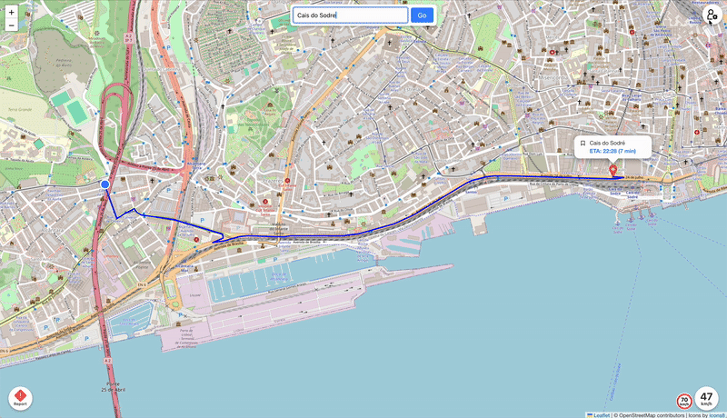
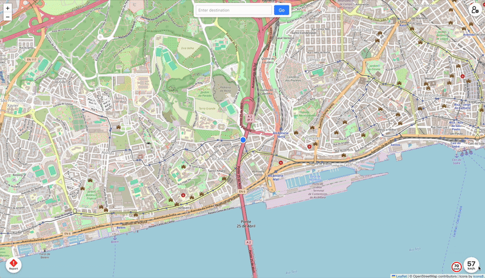
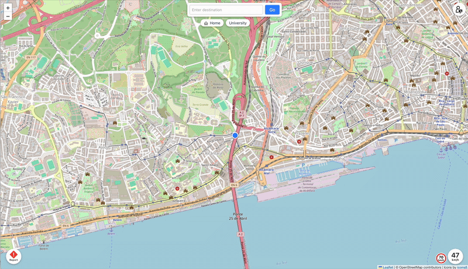
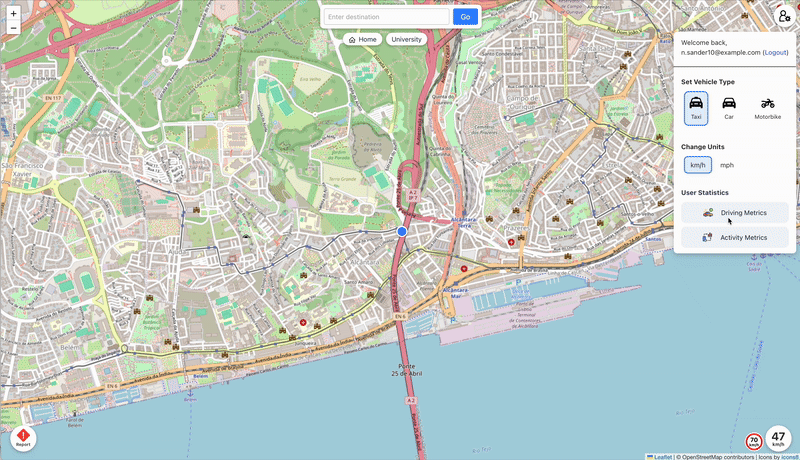

Running Instructions
---
__Backend:__
````bash
cd msp-mywaze-backend
npm i
npm run dev
````
__Frontend:__
````bash
cd msp-mywaze-frontend
npm i
npm run dev
````

The only prerequisites are a current version of node and npm. Database is implemented as SQLite, so no manual setup necessary.

Routing uses OpenRouteService, which is quota limited (daily) in the free version. If it stops working, please wait one day or change the variable ``ORS_API_KEY`` in ``msp-mywaze-backend/src/routes/routing.ts`` to your own (free) API key obtained on https://openrouteservice.org.

## Features Implemented

### Basic Features

- **Registration**: User can register and login on home page  
  

- **Vehicle Type Registration**: User can configure their vehicle type in drop down user menu on the top right of the screen  
  

- **Define Route**: User can define route by entering destination name or address into the text field in the top center and click _Go_  
  

- **ETA**: ETA is displayed in popup above destination after route is defined  
  *(Covered in the same gif as route definition)*

- **Speed Warning**: Current speed will turn red if user moves over the speed limit. To test speed warnings on desktop, click on the speed value to generate a random speed around 50 km/h  
  

---

### Advanced Existing Features

- **Bookmarking**: User can bookmark frequently used locations  
  

- **Hazard Reporting**: Users can report hazards encountered along the route  
  
  The recording shows 2 browser windows with with different user locations. Note that reports show up on both screens.

- **Recents**: Recently entered locations are shown for quick access  
  

- **Units**: Users can switch between metric and imperial units  
  

### Advanced New Features

- **Stats**: Displays statistics for average speed, distance, and active days  
  