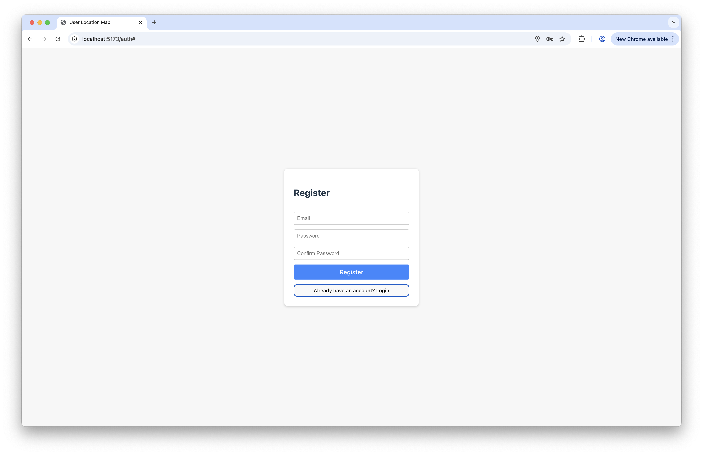

Running Instructions
---
__Backend:__
````bash
cd msp-mywaze-backend
npm i
npm run dev
````
__Frontend:__
````bash
cd msp-mywaze-frontend
npm i
npm run dev
````

The only prerequisites are a current version of node and npm. Database is implemented as SQLite, so no manual setup necessary.

Routing uses OpenRouteService, which is quota limited (daily) in the free version. If it stops working, please wait one day or change the variable ``ORS_API_KEY`` in ``msp-mywaze-backend/src/routes/routing.ts`` to your own (free) API key obtained on https://openrouteservice.org.

Features Implemented
---
- __Registration__: User can register and login on home page


- __Vehicle Type Registration__: User can configure their vehicle type in drop down user menu on the top right of the screen
- __Define Route__: user can define route by entering destination name or address into text field in the top center and click _Go_
- __ETA__: ETA is displayed in popup above destination after route is defined
- __Speed warning__: Current speed will turn red if user moves over 50 km/h. To test speed warnings on desktop, click on the speed value to generate a random speed around 50 km/h.

